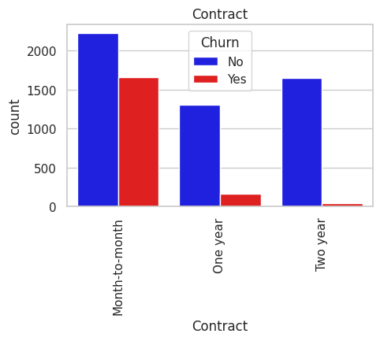
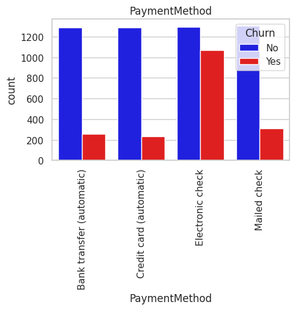
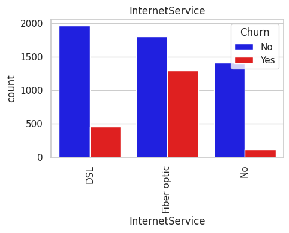
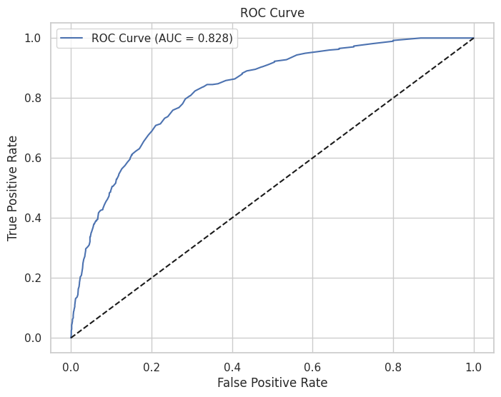
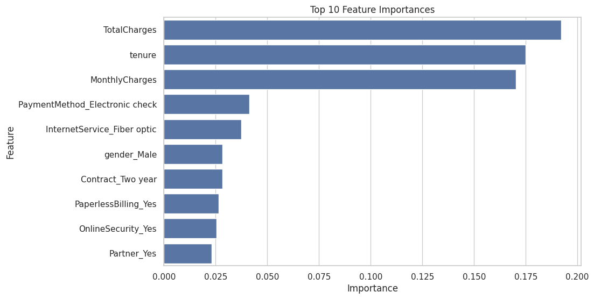

# Telco Customer Churn: Analysis and Prediction (Python)

An exploratory analysis and churn model for 7,043 telecom customers, covering demographics, services, contract, billing and tenure (21 features).

## Key findings

**Contract type is the strongest driver.** Month-to-month customers churn far more than customers on one- or two-year contracts.

**Electronic-check payers churn the most** of all payment methods.

**Fibre-optic customers churn more than DSL customers**, which suggests a price or service-quality problem worth investigating.

## Model
A Random Forest classifier: **79% accuracy, ROC AUC 0.83** on the held-out set. Total charges, tenure and monthly charges are the top predictors.

| ROC curve | Top 10 features |
|---|---|
|  |  |

**Tools:** Python, pandas, seaborn/matplotlib, scikit-learn
**Notebook:** [`Telco_Customer_Churn.ipynb`](Telco_Customer_Churn.ipynb)
